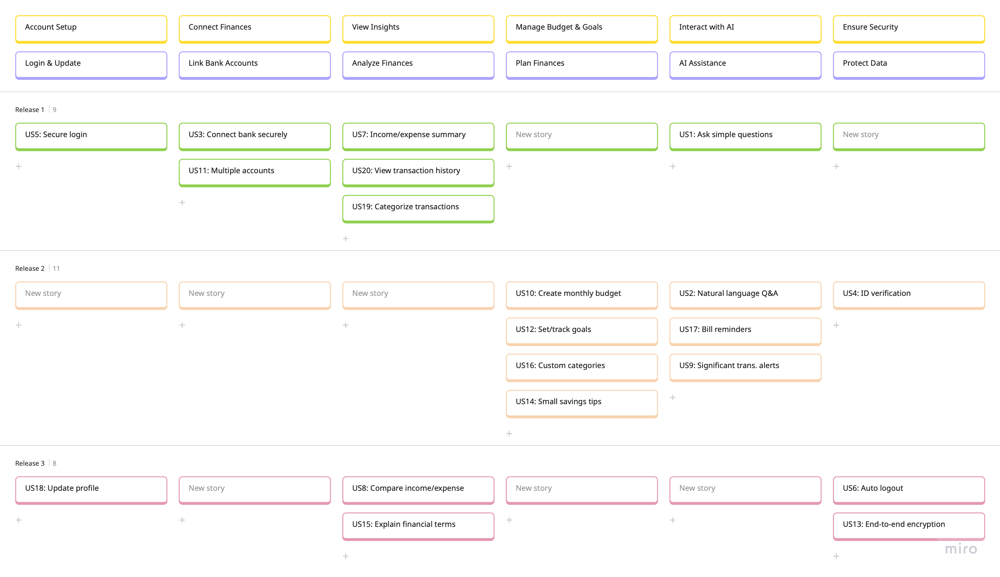

## Finsplore Product Backlog

### User Story Overview

| ID   | As a... | I want to...                                                                 | So that...                                                  | Priority | Estimation  | Status      |
|------|---------|------------------------------------------------------------------------------|-------------------------------------------------------------|----------|----------------------------|-------------|
| US1  | User    | Ask simple financial questions via an AI chatbot                             | I can quickly understand my spending habits                 | High     | 5                          | Done       |
| US2  | User    | Ask financial questions in natural language                                  | I can interact with the chatbot more intuitively            | High     | 8                          | To Do       |
| US3  | User    | Securely connect my bank account | I can safely retrieve my financial data | High     | 13                         | Done      |  
| US4 | Admin | Collect identity documents before granting access | My identity is submitted and stored for review | High | 13 | Done |
| US5  | User    | Sign up or log in securely                                                              | My account is protected and I can access it easily            | High     | 8                          | Done       |
| US6  | User    | Be logged out after inactivity                                               | My data is protected if I forget to log out                 | Medium   | 5                          | To Do       |
| US7  | User    | Access a summary of my financial accounts (e.g. income, expenses, net worth)                                      | I can track my financial health and adjust my spending accordingly                      | High     | 5                          | Done       |
| US8  | User    | Compare my income and expenses over time                                     | I can identify trends and adjust my financial habits        | Medium   | 8                          | To Do       |
| US9  | User    | Receive alerts for significant transactions                                  | I can stay aware of my spending and detect unusual activity | Medium   | 5                          | To Do       |
| US10 | User    | Create a monthly budget                                                      | I can plan my spending and save more effectively            | High     | 8                          | To Do       |
| US11 | User    | Connect multiple bank accounts                                               | I can see a consolidated view of my finances               | High     | 5                          | Done       |
| US12 | User    | Set and track financial goals                                                | I can save for specific purposes like a vacation            | High     | 8                          | To Do       |
| US13 | User    | Enable end-to-end encryption for my financial data                           | My information remains private and secure                   | Medium   | 8                          | To Do       |  
| US14 | User    | See small ways to save money each month                                      | I can start building my savings without feeling overwhelmed | Medium   | 5                          | To Do       |  
| US15 | User    | Have financial terms explained in plain language                             | I can make informed decisions without confusion             | Low      | 5                          | To Do       |  
| US16 | User    | Customize expense categories                                                 | I can track and adjust my family's finances more easily     | High     | 8                          | To Do       |  
| US17 | User    | Receive bill reminders in an AI assistant                                    | I never miss payments                                       | High     | 5                          | To Do       |  
| US18 | User    | Update my profile and contact details                                        | My account information stays accurate and updated           | Medium   | 5                          | To Do       |  
| US19 | User    | Categorize my transactions manually or automatically                                        | I can better understand my spending behavior           | High   | 5                          | In Progress      |  
| US20 | User    | View my transaction history with filters and search                                        | I can review my past financial activity conveniently           | High   | 3                          | Done       |  

1SP = 1 Story Point = Workload per person per day.
## Detailed User Stories

### User Story ID: US1
**Title:** AI-Powered Financial Questioning  
**As a user,** I want to ask simple financial questions via an AI chatbot, so that I can quickly understand my spending habits.  
**Priority:** High  
**Status:** Done  
**Estimation:** 5 Story Points  

- **Acceptance Criteria:**
  - User can select from a pre-built list of 5-10 common financial questions (e.g., “What was my expense last month?”).
  - Chatbot retrieves data from the user’s bank account via Basiq API.
  - Chatbot provides accurate answers with a basic breakdown (e.g., “You spent $2,000 last month: $1,000 on rent”).

- **Dependencies:**
  - Requires bank account connection (US3).
  - Depends on database setup for storing pre-built questions.

- **Notes:**
  - Initial implementation focuses on pre-built questions; natural language processing (US2) will be a future enhancement.
  - Ensure API rate limits are handled to avoid data retrieval issues.
  - US3 (secure bank connection) must be completed before this user story.

#### Product Backlog Considerations
**Epic:** AI-Powered Financial Chatbot  
**Sprint Placement:** Sprint 1  

- **Business Value:**
  - Enables users to understand their finances without expertise.
  - Reduces time spent on manual financial analysis.
  - Enhances user engagement with the app through interactive features.

---

### User Story ID: US2
**Title:** Natural Language Financial Questioning  
**As a user,** I want to ask financial questions in natural language (future enhancement), so that I can interact with the chatbot more intuitively.  
**Priority:** High  
**Status:** To Do  
**Estimation:** 8 Story Points  

- **Acceptance Criteria:**
  - User can type questions in natural language (e.g., “How much did I spend on groceries?”).
  - Chatbot interprets the query using NLP and provides accurate answers.
  - Fallback to pre-built questions if NLP fails to interpret the query.

- **Dependencies:**
  - Depends on US1 (pre-built question functionality).
  - Requires integration with an NLP engine (e.g., Dialogflow or similar).

- **Notes:**
  - This is a future enhancement; prioritize after basic chatbot functionality is stable.
  - Consider user feedback from US1 to refine NLP requirements.

#### Product Backlog Considerations
**Epic:** AI-Powered Financial Chatbot  
**Sprint Placement:** Sprint 3  

- **Business Value:**
  - Improves user experience with a more intuitive interface.
  - Increases app adoption by catering to less tech-savvy users.
  - Reduces user frustration with rigid question formats.

---

### User Story ID: US3  
**Title:** Secure Bank Account Connection  
**As a user,** I want to securely connect my bank account, so that I can safely retrieve my financial data.  
**Priority:** High  
**Status:** Done  
**Estimation:** 13 Story Points  

- **Acceptance Criteria:**  
  - User can connect their bank account via Basiq API with explicit consent.  
  - Data transmitted between the app and the bank is encrypted using HTTPS/TLS.  
  - Connection success is clearly confirmed to the user.  
  - Failed connection attempts are captured and logged for troubleshooting.  

- **Dependencies:**  
  - Requires Basiq API setup and credentials.  
  - Depends on backend infrastructure for secure data handling.  
  - Requires user authentication (US5) and compliance with data security standards (US4).

- **Notes:**  
  - Must comply with Australian CDR (Consumer Data Right) regulations.  
  - Test with multiple banks to ensure broad compatibility.  
  - Focus only on establishing and maintaining a secure connection; no transaction categorization or visualization at this stage.  

#### Product Backlog Considerations  
**Epic:** Secure Financial Data Management  
**Sprint Placement:** Sprint 1  

- **Business Value:**  
  - Builds user trust by ensuring the secure handling of sensitive banking information.  
  - Enables future functionality that depends on real-time financial data access.  
  - Forms a critical foundation for financial insights and personalized guidance.  

---

### User Story ID: US4
**Title:** Identity Information Collection Before Granting Access  
**As a admin,** I want to collect identity documents from users before granting access, so that the user's identity can be reviewed and verified manually.  
**Priority:** High  
**Status:** Done  
**Estimation:** 13 Story Points  

- **Acceptance Criteria:**  

  - User must submit at least two forms of identity (e.g., government-issued ID and proof of address).
  - Identity documents must be securely stored in the backend for manual verification.
  - Submission status must be logged and retrievable for audits.
  - Access is restricted until the identity documents are submitted.
  - Manual verification and approval will be handled outside the system.

- **Dependencies:**  
  - Backend system for securely storing and managing identity documents.
  - Secure login system (US5) to be in place. 

- **Notes:**  
  - Follow privacy and data protection regulations like GDPR and CDR when handling identity information.
  - Ensure secure storage and restricted access to identity documents.
  - Audit trails of submission must be immutable and securely stored for regulatory compliance.

#### Product Backlog Considerations  
**Epic:** Secure Financial Data Management  
**Sprint Placement:** Sprint 3  

- **Business Value:**  
  - Establishes a record of user identity before granting access to sensitive data.
  - Supports compliance with privacy and regulatory requirements.
  - Reduces risk of unauthorized access through document collection and manual review.
  
---

### User Story ID: US5
**Title:** Secure User Sign-up and Login  
**As a user,** I want to sign up and log in securely, so that my account is protected and I can access it confidently.  
**Priority:** High  
**Status:** Done  
**Estimation:** 8 Story Points  

- **Acceptance Criteria:**
  - Users can create an account with a valid email and password.
  - Passwords are stored using a secure hash (e.g., bcrypt or Argon2).
  - Users can log in with valid credentials and be redirected to their dashboard.
  - Brute-force protection is in place (e.g., 5 failed attempts before temporary lockout).
  - CAPTCHA is triggered after repeated failed login attempts.
  - Login sessions are managed via secure tokens (e.g., JWT with expiration).

- **Dependencies:**
  - User database with hashed credential storage.
  - Identification verification logic from ID verification (US4).
  - Frontend forms with validation and backend API integration.

- **Notes:**
  - Consider support for “Remember Me” and secure session timeout.
  - Add validation for password strength (e.g., min 8 characters, upper/lowercase, digit, symbol).
  - Audit login endpoints for injection and session fixation attacks.

#### Product Backlog Considerations
**Epic:** Secure Financial Data Management  
**Sprint Placement:** Sprint 1  

- **Business Value:**
  - Provides a secure entry point for user access.
  - Prevents unauthorized access and enhances user peace of mind.
  - Reduces security incident handling effort for the team.

---

### User Story ID: US6
**Title:** Auto-Logout After Inactivity  
**As a user,** I want the app to log me out after inactivity, so that my data is protected if I forget to log out.  
**Priority:** Medium  
**Status:** To Do  
**Estimation:** 5 Story Points  

- **Acceptance Criteria:**
  - App logs out user after 15 minutes of inactivity.
  - User receives a warning 1 minute before logout (e.g., “You will be logged out soon”).
  - Session data is cleared upon logout.
  - User must re-authenticate to regain access.

- **Dependencies:**
  - Depends on US5 (secure login functionality).
  - Requires session management implementation.

- **Notes:**
  - Test timeout functionality across different devices (mobile, desktop).
  - Allow users to configure timeout duration in future iterations.

#### Product Backlog Considerations
**Epic:** Secure Financial Data Management  
**Sprint Placement:** Sprint 2  

- **Business Value:**
  - Enhances security by preventing unauthorized access on shared devices.
  - Reduces risk of data exposure in public settings.
  - Aligns with privacy best practices.

---

### User Story ID: US7
**Title:** Income and Expense Summary  
**As a user,** I want to access a summary of my financial accounts (e.g. income, expenses, net worth) so that I can track my financial health and adjust my spending accordingly.  
**Priority:** High  
**Status:** Done  
**Estimation:** 5 Story Points  

- **Acceptance Criteria:**
  - App fetches income and expense data via Basiq API.
  - System separates income (e.g., salary) and expenses (e.g., rent).
  - Summary displays: “Income: $5,000 | Expenses: $2,000 | Savings: $3,000.”
  - Dashboard shows combined income, expenses, and savings across accounts.
  - Summary loads within 2 seconds.

- **Dependencies:**
  - Requires bank account connection (US3).
  - Depends on backend logic for transaction categorization.

- **Notes:**
  - Ensure data accuracy by validating API responses.
  - Consider adding filters (e.g., by date range) in future iterations.

#### Product Backlog Considerations
**Epic:** Income and Expense Management  
**Sprint Placement:** Sprint 2  

- **Business Value:**
  - Provides users with a clear overview of their cash flow.
  - Supports financial planning and decision-making.
  - Increases user satisfaction with actionable data.

---

### User Story ID: US8
**Title:** Income and Expense Trend Analysis  
**As a user,** I want to compare my income and expenses over time, so that I can identify trends and adjust my financial habits.  
**Priority:** Medium  
**Status:** To Do  
**Estimation:** 8 Story Points  

- **Acceptance Criteria:**
  - App retrieves income and expense data for the past 6 months.
  - System plots a line graph (e.g., income in green, expenses in red).
  - Trends are highlighted (e.g., “Expenses increased by 10% in March”).
  - Graph loads within 3 seconds.

- **Dependencies:**
  - Depends on US7 (income and expense summary).
  - Requires visualization library for line graphs (e.g., Chart.js).

- **Notes:**
  - Ensure graph is responsive for mobile devices.
  - Test with large datasets to verify performance.

#### Product Backlog Considerations
**Epic:** Income and Expense Management  
**Sprint Placement:** Sprint 3  

- **Business Value:**
  - Helps users identify financial trends for better planning.
  - Encourages proactive financial behavior adjustments.
  - Enhances user engagement with interactive features.

---

### User Story ID: US9
**Title:** Transaction Alerts  
**As a user,** I want to receive alerts for significant transactions, so that I can stay aware of my spending and detect unusual activity.  
**Priority:** Medium  
**Status:** To Do  
**Estimation:** 5 Story Points  

- **Acceptance Criteria:**
  - User can set a threshold for alerts (e.g., transactions over $100).
  - App sends a push notification within 5 minutes of a qualifying transaction (e.g., “You spent $150 at Supermarket”).
  - Alerts include transaction details (amount, merchant, date).
  - User can enable/disable alerts in settings.

- **Dependencies:**
  - Requires bank account connection (US3).
  - Depends on backend setup for real-time transaction monitoring.

- **Notes:**
  - Use Basiq API’s webhook functionality for real-time updates if available.
  - Test notification delivery across iOS and Android devices.

#### Product Backlog Considerations
**Epic:** Financial Monitoring and Alerts  
**Sprint Placement:** Sprint 2  

- **Business Value:**
  - Keeps users informed of their financial activity in real time.
  - Enhances security by flagging potential fraud early.
  - Increases user trust and app stickiness.

---

### User Story ID: US10
**Title:** Budget Creation  
**As a user,** I want to create a monthly budget, so that I can plan my spending and save more effectively.  
**Priority:** High  
**Status:** To Do  
**Estimation:** 8 Story Points  

- **Acceptance Criteria:**
  - User can set budget limits for categories (e.g., $300 for groceries, $1,000 for rent).
  - App displays budget vs. actual spending (e.g., “Groceries: $250/$300”).
  - Budget setup is saved and editable.

- **Dependencies:**
  - Requires transaction categorization (US19).
  - Depends on US7 (income and expense summary) for budget calculations.

- **Notes:**
  - Allow users to copy previous month’s budget as a template in future iterations.
  - Ensure budget data persists across sessions.

#### Product Backlog Considerations
**Epic:** Budgeting and Financial Planning  
**Sprint Placement:** Sprint 2  

- **Business Value:**
  - Empowers users to control their finances proactively.
  - Drives long-term engagement by supporting financial goals.
  - Differentiates the app from basic tracking tools.

---

### User Story ID: US11
**Title:** Multi-Account Support  
**As a user,** I want to connect multiple bank accounts, so that I can see a consolidated view of my finances.  
**Priority:** High  
**Status:** Done  
**Estimation:** 5 Story Points  

- **Acceptance Criteria:**
  - User can link additional bank accounts via Basiq API.
  - User can toggle between individual account views and consolidated view.

- **Dependencies:**
  - Requires secure bank connection (US3).
  - Depends on backend logic for data aggregation.

- **Notes:**
  - Test with at least 3 different bank providers.
  - Consider UI adjustments for displaying multiple accounts cleanly.

#### Product Backlog Considerations
**Epic:** Secure Financial Data Management  
**Sprint Placement:** Sprint 3  

- **Business Value:**
  - Appeals to users with complex financial setups.
  - Provides a more complete picture of user finances.
  - Increases app utility and user retention.

---

### User Story ID: US12
**Title:** Goal Setting and Tracking  
**As a user,** I want to set and track financial goals, so that I can save for specific purposes like a vacation or emergency fund.  
**Priority:** High  
**Status:** To Do  
**Estimation:** 8 Story Points  

- **Acceptance Criteria:**
  - User can create a goal with a name, target amount, and deadline (e.g., “Vacation: $2,000 by Dec 2025”).
  - App automatically adds a category to tracks progress based on savings (e.g., “$500 saved, 25% complete”).
  - Progress is visualized with a progress bar or similar.
  - User receives a notification when the goal is achieved.

- **Dependencies:**
  - Depends on US10 (budget creation) for goal funding.

- **Notes:**
  - Allow users to edit or delete goals.
  - Consider gamification elements (e.g., badges) in future iterations.

#### Product Backlog Considerations
**Epic:** Budgeting and Financial Planning  
**Sprint Placement:** Sprint 2  

- **Business Value:**
  - Motivates users to save and engage with the app regularly.
  - Supports long-term financial health.
  - Differentiates the app with goal-oriented features.

---

### User Story ID: US13  
**Title:** End-to-End Encryption for Financial Data  
**As a User,** I want end-to-end encryption for my financial data, so that my information remains private and secure.  
**Priority:** Medium  
**Status:** To Do  
**Estimation:** 8 Story Points  

- **Acceptance Criteria:**  
  - Financial data is encrypted at rest and in transit.  
  - Only authorized users can decrypt and access their data.  
  - End-to-end encryption applies to all sensitive user information.  
  - Encryption keys are securely managed and not stored on the server.  

- **Dependencies:**  
  - Requires implementation of encryption mechanisms.  
  - Needs key management infrastructure.  
  - Depends on US3 (secure bank connection) for data handling.

- **Notes:**  
  - Follow industry encryption standards (e.g., AES-256, RSA).  
  - Ensure compliance with relevant data protection laws (e.g., GDPR, CDR).  

#### Product Backlog Considerations  
**Epic:** Secure Financial Data Management  
**Sprint Placement:** Sprint 2  

- **Business Value:**  
  - Enhances user trust by ensuring privacy.  
  - Protects sensitive financial information from unauthorized access.  
  - Aligns with security best practices for financial applications.  

---

### User Story ID: US14  
**Title:** Smart Savings Recommendations  
**As a User,** I want to see small ways to save money each month, so that I can start building my savings without feeling overwhelmed.  
**Priority:** Medium  
**Status:** To Do  
**Estimation:** 5 Story Points  

- **Acceptance Criteria:**  
  - App suggests personalized savings tips based on transaction history.  
  - Users can set small savings goals with progress tracking.  
  - Provides a breakdown of unnecessary expenses.  

- **Dependencies:**  
  - Requires transaction categorization.  
  - Depends on US7 (income and expense summary) for analysis and US10 (budget creation) for goal setting.  

- **Notes:**  
  - Use AI-based analysis to recommend saving strategies.  
  - Ensure suggestions are practical and actionable.  

#### Product Backlog Considerations  
**Epic:** Financial Planning & Budgeting  
**Sprint Placement:** Sprint 2  

- **Business Value:**  
  - Helps users save money in a manageable way.  
  - Encourages long-term financial stability.  
  - Improves user engagement through actionable insights.  

---

### User Story ID: US15  
**Title:** Plain Language Financial Explanations  
**As a User,** I want financial terms explained in plain language, so that I can make informed decisions without confusion.  
**Priority:** Low  
**Status:** To Do  
**Estimation:** 5 Story Points  

- **Acceptance Criteria:**  
  - Complex financial terms include plain-language explanations.  
  - Users can tap on terms for definitions and examples.  
  - Glossary of financial terms is accessible within the app.  

- **Dependencies:**  
  - Requires a financial term database.  
  - Needs UI implementation for tooltips or pop-ups.  

- **Notes:**  
  - Ensure explanations are clear and free from technical jargon.  
  - Provide localized explanations for different regions.  

#### Product Backlog Considerations  
**Epic:** Financial Education & Literacy  
**Sprint Placement:** Sprint 2  

- **Business Value:**  
  - Helps users make informed financial decisions.  
  - Improves accessibility for non-expert users.  
  - Increases user confidence in managing finances.  

---

### User Story ID: US16  
**Title:** Customizable Expense Categories  
**As a User,** I want to customize expense categories, so I can track and adjust my family's finances more easily.  
**Priority:** High  
**Status:** To Do  
**Estimation:** 8 Story Points  

- **Acceptance Criteria:**  
  - Users can create, edit, and delete custom expense categories.  
  - Transactions can be manually assigned to categories.  
  - Expense reports reflect custom categories.  

- **Dependencies:**  
  - Requires transaction categorization system.  
  - Needs database support for user-defined categories.  
  - Depends on US19 (transaction categorization) for integration.

- **Notes:**  
  - Allow bulk-editing of transactions for easier categorization.  
  - Provide default categories for quick setup.  

#### Product Backlog Considerations  
**Epic:** Financial Planning & Budgeting  
**Sprint Placement:** Sprint 1  

- **Business Value:**  
  - Enables better financial organization.  
  - Supports unique financial management needs.  
  - Provides flexibility for complex financial scenarios.  

---

### User Story ID: US17  
**Title:** AI Bill Reminders  
**As a User,** I want bill reminders in an AI assistant, so that I never miss payments.  
**Priority:** High  
**Status:** To Do  
**Estimation:** 5 Story Points  

- **Acceptance Criteria:**  
  - Users receive automated bill reminders via AI assistant.  
  - Reminders include due dates and payment details.  
  - Users can customize reminder settings (e.g., frequency, notification type).  

- **Dependencies:**  
  - Requires AI assistant integration.  
  - Needs a scheduling system for reminders.  
  - Depends on US3 (secure bank connection) for bill data retrieval and US1 (for chatbot interaction).

- **Notes:**  
  - Allow linking reminders to calendar apps.  
  - Ensure reminders are customizable to avoid notification fatigue.  

#### Product Backlog Considerations  
**Epic:** Financial Planning & Budgeting  
**Sprint Placement:** Sprint 1  

- **Business Value:**  
  - Prevents missed bill payments and late fees.  
  - Reduces financial stress for users.  
  - Improves user engagement with proactive assistance.

---

### User Story ID: US18  
**Title:** Profile and Contact Information Management  
**As a user,** I want to update my profile and contact details, so that my account information stays accurate and updated.  
**Priority:** Medium  
**Status:** To Do  
**Estimation:** 5 Story Points  

- **Acceptance Criteria:**  
  - User can edit profile details (e.g., name, email, phone number).  
  - Changes are saved and updated in real-time.  
  - User receives a confirmation message after updating details.  
  - Email and phone number updates require verification (e.g., email confirmation link, SMS OTP).  
  - Errors (e.g., invalid email format, duplicate phone number) are displayed clearly.  
  - Users cannot change critical information like bank-linked accounts from this section.  

- **Dependencies:**  
  - Requires user authentication (US5).  
  - Needs backend support for storing and updating user data securely.  
  - Depends on email/SMS service integration for verification.  

- **Notes:**  
  - Ensure compliance with data privacy laws (e.g., GDPR, CDR).  
  - Use a secure database to store user information.  
  - Implement rate limits to prevent spammy update requests.  
  - Allow users to cancel pending verification and revert to old details.  

#### Product Backlog Considerations  
**Epic:** User Account Management  
**Sprint Placement:** Sprint 2  

- **Business Value:**  
  - Enhances user trust by allowing profile customization.  
  - Reduces customer support requests for manual updates.  
  - Improves user experience by keeping contact details up to date.  
  - Ensures important notifications (e.g., bill reminders, transaction alerts) reach the right contact.

---

### User Story ID: US19  
**Title:** Transaction Categorization  
**As a user,** I want my transactions to be categorized automatically or manually, so that I can better understand where my money goes.  
**Priority:** High  
**Status:** Done  
**Estimation:** 5 Story Points  

- **Acceptance Criteria:**  
  - Transactions are automatically categorized (e.g., groceries, rent, utilities) using AI/NLP or rule-based logic.
  - Users can manually re-categorize any transaction.
  - Users can create custom categories.
  - Category changes are saved and reflected in analytics.

- **Dependencies:**  
  - Access to transaction metadata (description, amount, merchant) (US3).
  - Backend logic or ML model for categorization.
  - UI for category display and manual override.

- **Notes:**  
  - Track accuracy metrics to evaluate auto-categorization model.
  - Include an “uncategorized” fallback for edge cases. 

#### Product Backlog Considerations  
**Epic:** Personalized Financial Insights  
**Sprint Placement:** Sprint 2  

- **Business Value:**  
  - Enhances visibility of spending habits.
  - Supports budget tracking and financial planning features.
  - Increases user satisfaction by adding flexibility and control.

---

### User Story ID: US20  
**Title:** View Transaction History  
**As a user,** I want to view my transaction history with filters and search, so that I can conveniently track my financial activity.  
**Priority:** High  
**Status:** In Progress  
**Estimation:** 3 Story Points  

- **Acceptance Criteria:**  
  - Users can view a list of past transactions sorted by date.
  - Filters are available (e.g., category, amount range, bank account).
  - Search bar allows keyword-based lookup (e.g., merchant name).
  - Pagination or infinite scroll is supported for performance.
  - Clicking on a transaction shows full details (e.g., date, amount, description, category, account).

- **Dependencies:**  
  - Connection to backend transaction storage API.
  - Filtering, search, and pagination logic.
  - UI/UX for transaction list and detail view.
  - Depends on US3 (secure bank connection) for transaction data retrieval.

- **Notes:**  
  - Consider showing total income and spending during filter periods.
  - Support exporting transaction history as CSV or PDF.

#### Product Backlog Considerations  
**Epic:** Financial Activity Overview  
**Sprint Placement:** Sprint 2  

- **Business Value:**  
  - Empowers users to take control of their financial records.
  - Enables transparency and trust in the system.
  - Lays the foundation for budgeting, alerts, and trends.

## User Story Mapping
### Finsplore User Story Mapping

| Priority         | Account Setup           | Connect Finances              | View Insights                    | Manage Budget & Goals       | Interact with AI            | Ensure Security             |
|------------------|-------------------------|-------------------------------|----------------------------------|-----------------------------|-----------------------------|-----------------------------|
| **User Activities** | Account Setup           | Connect Finances              | View Insights                    | Manage Budget & Goals       | AI Assistance               | Protect Data                |
| **User Tasks**     | Login & Update          | Link Bank Accounts            | Analyze Finances                 | Plan Finances               | AI Chat & Reminders         | Auth & Data Security        |
| **Sprint 1**       | US5: Signup/Login       | US3: Connect bank securely    | US7: Income/expense summary      |                             | US1: Ask simple questions   |         |
|                    |                         | US11: Multiple accounts       | US20: View transaction history   |                             |    |                             |
|                    |                         |                               | US19: Categorize transactions    |                             |                             |                             |
| **Sprint 2**       |                         |                               |                                  | US10: Create monthly budget | US2: Natural language Q&A        | US4: ID verification                            |
|                    |                         |                               |                                  | US12: Set/track goals       | US17: Bill reminders |                             |
|                    |                         |                               |                                  | US16: Custom categories      | US9: Significant trans. alerts                            |                             |
|                    |                         |                               |                                  | US14: Small savings tips     |                             |                             |
| **Sprint 3**       | US18: Update profile    |                               | US8: Compare income/expense      |                             |                             | US6: Auto logout            |
|                    |                         |                               |                                  |                             |                             | US13: End-to-end encryption |
|                    |                         |                               | US15: Explain financial terms    |                             |                             |                             |

---

> Note: This document was originally produced with the assistance of OpenAI’s ChatGPT; the content has been subsequently reviewed, revised in detail, and refined through editing according to requirements.